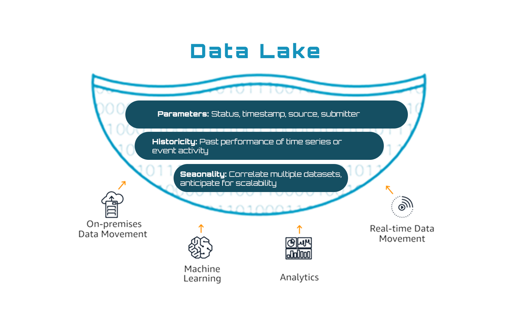


# Technical Area 1,2,3,9:
The infographic shown below depicts how Diamond Information Systems will implement the solution for Technical Area 1, 2, 3 and 9.
## Infographic

## Detailed infographic for Data Lakes

## Detailed infographic for Moving Target Defense

## Detailed infographic for DevSecOps

## Detailed infographic for AIOps

# Technical Areas 4, 10-2, 11, 12, 13, 14, 15: 
The infographic shown below depicts how Diamond Information Systems will implement the solution for Technical Areas 4, 10 (applies to the second 10), 11, 12, 13, 14 and 15.
## Infographic

# Technical Areas 7,8:
The infographic shown below depicts how Diamond Information Systems will implement the solution for Technical Areas 7 and 8.
## Infographic

